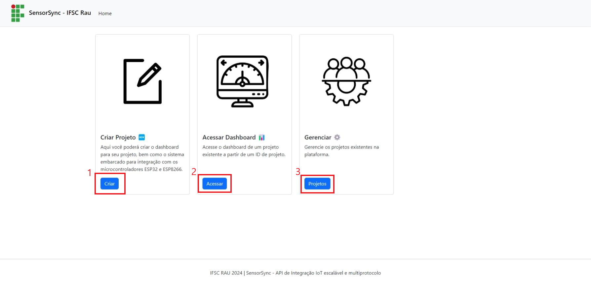

# sensorsync - API REST para integração MQTT/REST de microcontroladores a Banco de Dados MySQL

Este projeto é uma plataforma de desenvolvimento IoT de fácil uso que possibilita automatizar a criação de projetos IoT
através de geração de microcódigo, geração de dashboard e integração automática com banco de dados MySQL.
Ou seja, múltiplos projetos IoT são suportados, vinculados a múltiplos controladores conectados (possuí biblioteca de integração para ESP8266 e ESP32), 
que submetem e leem múltiplos dados (via protocolos HTTP e MQTT, inclusive simultaneamente). 

Essa plataforma é implementada sob a seguinte stack: Java 21, Banco de dados MySQL e Mosquitto Broker. 
A seguir, é apresentada um documentação a respeito do uso desse sistema em ambiente de produção (Raspberry PI 3 com Ubuntu Server embarcado, na rede do laboratório de pesquisa do IFSC - Rau)
e da implementação do mesmo e sua stack em Ubuntu Server e Windows. 

<hr>

#### Sumário:

[Uso em ambiente de produção](#uso-do-sistema-em-ambiente-de-produção-laboratório-de-pesquisa-do-ifsc-rau)

[Inicializar o sistema no ambiente de produção](#inicializar-o-sistema-no-ambiente-de-produção)

[Implementar a Stack em Raspberry PI com Ubuntu Server](#implementar-a-stack-em-raspberry-pi-com-ubuntu-server)

[Implementar a Stack em Computador Windows](#implementar-a-stack-em-computador-windows)

<hr>

## Uso do sistema em ambiente de produção (Laboratório de pesquisa do IFSC Rau)

#### Acesso do sistema

- Para acessar o sistema é necessário estar na rede do laboratório. Faça o acesso conforme as credenciais abaixo:

Nome:

```
Sistema_IoT
```

Senha:

```
entrarentrar
```

- Dentro dessa rede, o sistema estará disponível no seguinte link (pode ser acessado a partir de qualquer navegador):

```
http://10.0.0.103:8080/
```

- Ao acessar o sistema, será aberta a seguinte tela inicial:



#### Criação de projetos IoT

- Acesse o menu 1 destacado na imagem anterior, será aberta uma tela conforme a figura a seguir:


- Para criar seu projeto IoT, basta preencher os dados conforme seus requisitos de projeto e então pressione o botão "Criar" destacado na imagem acima. A seguir será aberta uma nova guia com o código do sistema embarcado para o controlador definido. 

> :bulb: **Atenção:** Para que a integração funcione, é necessário baixar a biblioteca de integração disponível neste [link](https://1drv.ms/f/s!Aun1_-xL9pS4jY01hmCQVaL5HULldw?e=g9c7Ec) (link [alternativo](Integration_library/sensor_sync.h)). Basta salvá-la no diretório de compilação do seu sistema embarcado.

Uma vez que o projeto foi criado, é possível acessar seu dashboard conforme o tópico a seguir. 

#### Acessar Projetos IoT

- Para acessar um projeto, basta clicar no botão 2 ("Acessar") destaco da primeira figura. Ao fazer isso, será aberta uma janela com a lista dos sistemas cadastrados. Basta clicar no seu sistema e seu dashboard será aberto, A figura abaixo ilustra um dashboard que já recebeu alguns dados do controlador.


> :bulb: **Atenção:** Ao clicar no botão "Opções", destacado na imagem acima, é aberta uma janela com ajustes para as visualizações dos dados. Como range do gráfico e atualização em tempo real.


#### Gerenciar projetos IoT

- É possível excluir projetos IoT através ao clicar no botão 3 ("Gerenciar") destacado na figura da tela inicial. Somente administradores podem acessar essa janela.   

<hr>


## Inicializar o sistema no ambiente de produção

- Para inicializar o sistema e sua stack, é necessário acessar o servidor Raspberry PI 3. Isso pode
ser feito de duas maneiras: acessá-lo remotamente via SSH ou diretamente, conectando ao mesmo monitor e teclado.

#### Acesso via SSH

- Acesse a rede do sistema de acordo com os passos iniciais da seção anterior, certifique-se que o Rasberry está ligado e conectado na rede.

> :bulb: **Atenção:** Dentro dessa rede, entre com o comando `ping 10.0.0.103` para saber se o Rasberry está ligado 
> e conectado ou não. Caso aconteça algum erro, proceda o acesso da outra forma apresentada no próxima [subseção](#acesso-direto).


- Através de um terminal em seu computador, insira o seguinte comando:


```
ssh ubuntu@10.0.0.103
```
- Digite a senha para entrar na conexão:


```
raspberry
```

A partir de então esse terminal estará representando o acesso no servidor.

#### Acesso direto

- Conecte um monitor e um teclado no Raspberry e então o ligue na tomara. O Ubuntu Server iniciará e será solicitada um senha de usuário. 
Entre com as credenciais abaixo.

Login:
```
ubuntu
```

Senha:
```
raspberry
```

- Digite o comando abaixo para carregar o layout de teclado correto:

```
sudo loadkeys br
```

Será solicitada a senha para realizar esse comando. Entre com a senha anterior.

#### Subir a API

- Primeiramente é necessário checar o horário do servidor através do comando abaixo:

```
date
```

- Caso seja necessário alterar o horário, ajuste com o seguinte comando (substitua a data e hora pelos valores atuais):

```
sudo date --set="2024-07-1 10:59:59.990"
```

- Os elementos da stack do sistema já inicializam automaticamente com o sistema operacional e o arquivo da API já está no diretório inicial. Para iniciar a API basta executar o seguinte comando:


```
java jar sensorsync-0.0.1-SNAPSHOT.jar
```

> :bulb: **Dica:** Evite desligar o servidor para não perder esses ajustes.


<hr>

## Implementar a Stack em Raspberry PI com Ubuntu Server

> :bulb: **Atenção:** Para isso é necessário um conhecimento básico de bash (essa [documentação](https://github.com/mwsprotte/shell-lessons) apresenta um resumo de comandos que pode ser útil). 

- Instalar a imagem do Ubuntu server para Raspberry PI 3 através da [ferramenta](https://www.raspberrypi.com/software/) oficial.

- Conectar na internet, instalar o Java 21 e o banco de dados MySQL de acordo com esta [documentação](https://medium.com/geekculture/turn-your-raspberry-pi-into-a-server-to-run-your-java-spring-mvc-app-862214279587) (fazer até a etapa de instalar o banco de dados, atente-se para instalar o Java 21 e não o padrão conforme a documentação faz).

> :bulb: **Atenção:** Use `senhasenha` como senha para usuário `root` do banco de dados para que o sistema possa acessá-lo (será feita a configuração da senha no momento de instalação do banco).

- Instalar o serviço Mosquitto MQTT Broker seguindo essa [documentação](https://randomnerdtutorials.com/how-to-install-mosquitto-broker-on-raspberry-pi/) (inclusive até a etapa de desabilitar a autenticação ("Mosquitto Broker Enable Remote Access (No Authentication)", uma vez que a API não usa esse recurso).

- Copiar o arquivo `.jar` do sistema para o servidor (esse arquivo está disponível no seguinte [link](https://1drv.ms/f/s!Aun1_-xL9pS4jY03s0lt3ZXq9kZU0g?e=G1Tx0P)). Isso pode ser feito por meio de [pendrive](https://pt.linux-console.net/?p=9786)) ou via [SSH](https://utilidadenices.com.br/copiar-arquivo-ou-pasta-via-ssh-servidor-local-remoto/).

- Com as serviços da stack já instalados e o arquivo da API no servidor, basta executar o sistema seguindo os passos do [capítulo anterior](#inicializar-o-sistema-no-ambiente-de-produção). 

<hr>

## Implementar a Stack em Computador Windows

#### Mosquitto Broker

- Instalar moquitto broker conforme
  esta [documentação](https://cedalo.com/blog/how-to-install-mosquitto-mqtt-broker-on-windows/?utm_source=in_page&utm_medium=Cedalo&utm_campaign=publer).
  Não é necessário configurar autenticação para os testes, porém é necessário seguir os passos para configurar a
  variavel de ambiente do mosquitto.

- Abrir o prompt de comandos e iniciar o broker através do seguinte comando:

```
mosquitto -v
```

- Em uma nova janela do prompt de comando, fazer o subscribe em um tópico qualquer para testes:

```
mosquitto_sub -t NOME_DO_TOPICO
```
> :bulb: **Atenção:** Fazendo dessa forma ele usará o localhost (IP local) e a porta 1883 como padrão. Para usar outras possibilidades, conulte esta [documentação](https://team-ethernet.github.io/guides/How%20to%20install%20and%20use%20Mosquitto%20for%20Windows.pdf).


- Para publicar um dado no tópico criado na etapa anterior, basta abrir uma nova janela no prompt e dar o seguinte
  comando:

```
mosquitto_pub -t NOME_DO_TOPICO -m "MENSAGEM" 
```

O segundo prompt aberto (subscribe) retornará a mensagem passada.

> :bulb: **Atenção:** Se acontecer erro 'ao publicar a mensagem, é necessário permitir publicações anônima de acordo com
> esta [documentação](https://mosquitto.org/man/mosquitto-conf-5.html).

#### Banco de dados MSQL

- Para subir o banco de dados é necessário primeiramente instalar o [MySQL Server](https://dev.mysql.com/downloads/mysql/). Na instalação, configure a seguinte senha para o usuário `root`: 


```
senhasenha
```

#### Java

- Instalar o [Java 21](https://www.oracle.com/java/technologies/javase/jdk21-archive-downloads.html)


- Baixar o arquivo `.jar` do sistema (esse arquivo está disponível no seguinte [link](https://1drv.ms/f/s!Aun1_-xL9pS4jY03s0lt3ZXq9kZU0g?e=G1Tx0P)). 

- Abrir um terminal na pasta onde o arquivo foi salvo e executar o seguinte comando:


```
java jar sensorsync-0.0.1-SNAPSHOT.jar
```

> :bulb: **Atenção:** Use o IP do seu computador como host no código de integração dos microcontroladores nesse caso.
